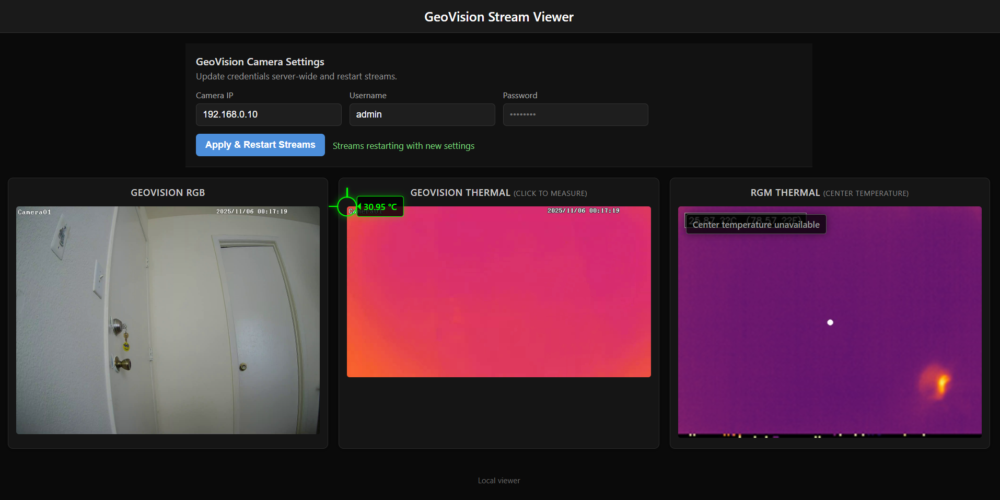

# GeoVision Camera Toolkit

Simple Flask UI for monitoring a GeoVision RGB/thermal IP camera alongside a local RGM thermal sensor. Click anywhere on the GeoVision thermal stream to read temperatures and watch the RGM center-point temperature update live.



## Run It

```powershell
cd C:\Users\aniruddh\IPcam_stream
python -m venv .venv          # optional but recommended
.\.venv\Scripts\Activate.ps1
pip install -r requirements.txt

# (optional) preset defaults; you can also edit them later in the UI form
$env:GEOVISION_IP="192.168.0.10"
$env:GEOVISION_USER="admin"
$env:GEOVISION_PASS="admin123"

python app.py
# open http://localhost:8000
```

In the browser, use the **GeoVision Camera Settings** form to update IP/username/password; the RGB and thermal panes will restart automatically. RGM stream settings (device index, MSMF vs DirectShow, etc.) can still be overridden via environment variables when needed:

- `RGM_DEVICE_INDEX` (default `0`)
- `RGM_USE_MSMF` (`true`/`false`, default `false`)
- `RGM_VIEW_SCALE` (default `3`)
- `RGM_TEMP_MIN_C` / `RGM_TEMP_MAX_C` (defaults `20` / `40`)

Other helper scripts remain available:

- `python temp_test.py` – stand-alone GeoVision thermal viewer
- `python record_test.py` – dual-stream recorder
- `python temperature_api_test.py` – CLI probe of the GeoVision API
- `python demo.py` – simple RGB-only window
